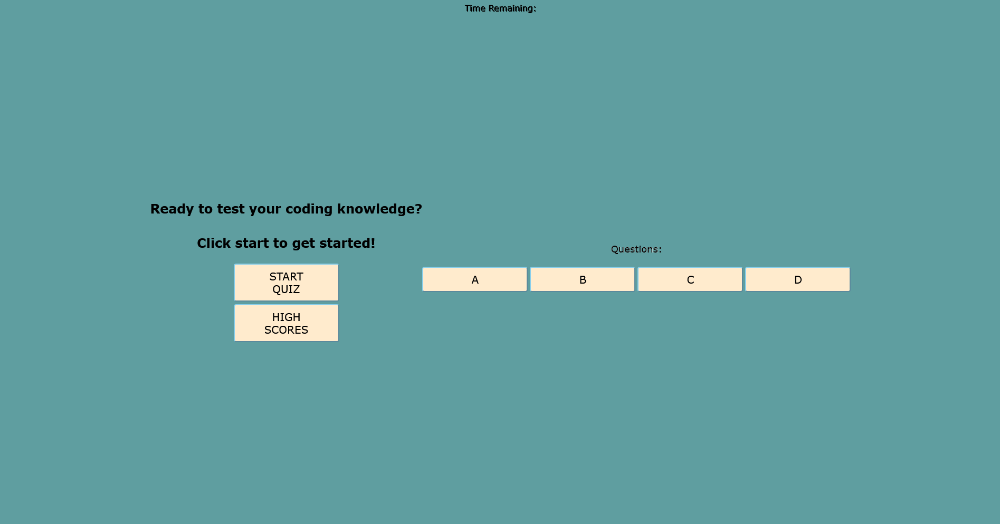

# Javascript-Quiz

This assignment required us to create a quiz utilizing javascript throughout the quiz. Utilizing javascript allowed us to affect the buttons and times in conjunction with one another. The quiz will run in the browser by HTML & CSS while being powered by Javascript code to allow the application to function seamlessly.

# User Story

AS A coding boot camp student
I WANT to take a timed quiz on JavaScript fundamentals that stores high scores
SO THAT I can gauge my progress compared to my peers

# Description

Quizzes in general allow its' students to assess their skills and knowledge. This quiz in particular allows those who take it to test their javascript knowledge.

# Considerations

As I worked through the assignment, I had to think of each function uniquely and had to ensure that each item would communicate with the HTML accordingly. For example, are the IDs labeled right in both the HTML & Script? Is the CSS picking up the HTML IDs and/or classes? Other considerations to keep in mind are the eventListeners for the Script and ensuring the buttons worked appropriately throughout the assignment. At the same time, I was making sure that the code was kept clean throughout the creation process.

# Acceptance Criteria

GIVEN I am taking a code quiz
WHEN I click the start button
THEN a timer starts and I am presented with a question
WHEN I answer a question
THEN I am presented with another question
WHEN I answer a question incorrectly
THEN time is subtracted from the clock
WHEN all questions are answered or the timer reaches 0
THEN the game is over
WHEN the game is over
THEN I can save my initials and my score

# Contributors

Angelica Sargent

# Screenshot

# Link
Take a look at this [link]().